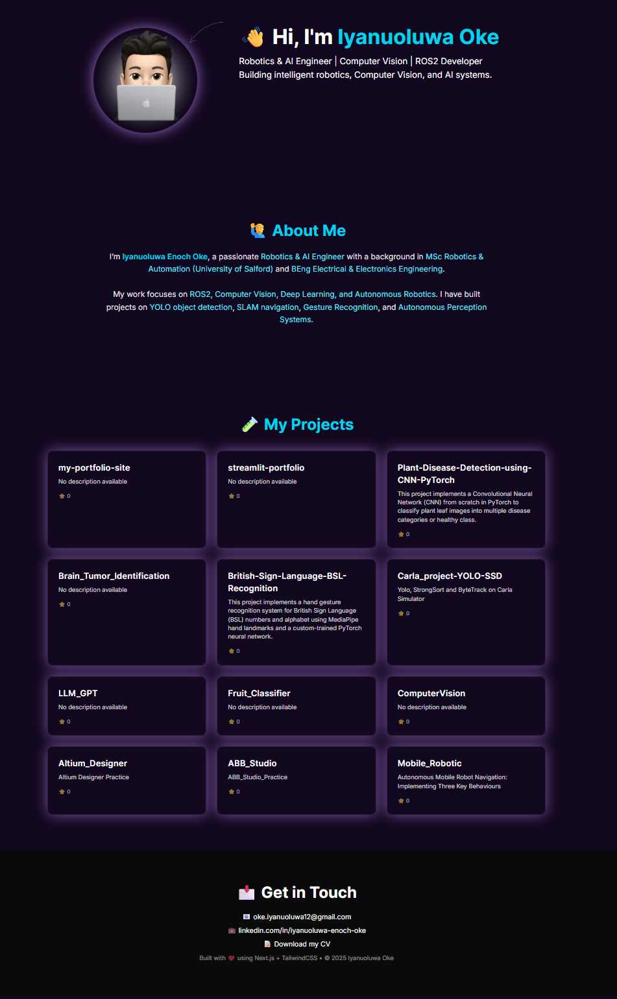

# 🌐 Personal Portfolio – Iyanuoluwa Oke

This is my personal **portfolio website** built with [Next.js](https://nextjs.org/), [Tailwind CSS](https://tailwindcss.com/), and [Framer Motion](https://www.framer.com/motion/).  
It showcases my work in **Robotics, AI/ML, and Computer Vision** with direct integration to my GitHub repositories.

🚀 Live Site: [iyanuoluwaoke.vercel.app](https://iyanuoluwaoke.vercel.app/)

---

## ✨ Features
- 🎨 **Modern UI** with custom Figma-inspired design  
- 🌌 **Global background** with glow effects for sections  
- 🤖 **Hero section** with avatar, animated arrow, and quick contact links  
- 🙋 **About Me** page describing my academic & professional background  
- 📂 **Projects** page that automatically fetches my GitHub repositories  
- 📬 **Get in Touch** section with email, LinkedIn, and GitHub links  
- ⚡ **Deployed on Vercel** with continuous integration from GitHub

---

## 📂 Tech Stack
- **Framework**: [Next.js 15](https://nextjs.org/)  
- **Styling**: [Tailwind CSS](https://tailwindcss.com/)  
- **Animations**: [Framer Motion](https://www.framer.com/motion/)  
- **Deployment**: [Vercel](https://vercel.com/)  
- **Version Control**: Git & GitHub  

---

## 🛠️ Installation & Setup

Clone the repo and run locally:

```bash
# Clone repo
git clone https://github.com/Iyanuoluwa007/my-portfolio-site.git

# Go into project folder
cd my-portfolio-site

# Install dependencies
npm install

# Run dev server
npm run dev
```

### Open in browser
```bash
http://localhost:3000
```
---

## 📸 Screenshots



---

## 📬 Contact Me

- 📧 Email: [oke.iyanuoluwa12@gmail.com](mailto:oke.iyanuoluwa12@gmail.com)  
- 💼 LinkedIn: [linkedin.com/in/iyanuoluwa-enoch-oke](https://www.linkedin.com/in/iyanuoluwa-enoch-oke/)  
- 💻 GitHub: [github.com/Iyanuoluwa007](https://github.com/Iyanuoluwa007)  
- 📝 CV: [Download Here](https://drive.google.com/file/d/1QwpycQIutZnM9STD5lv9PMcv4v3nZxjS/view?usp=sharing)
